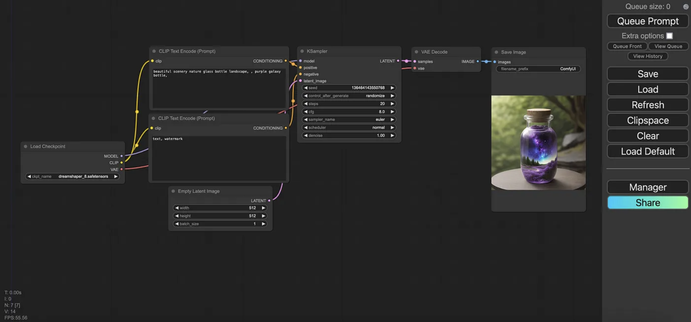
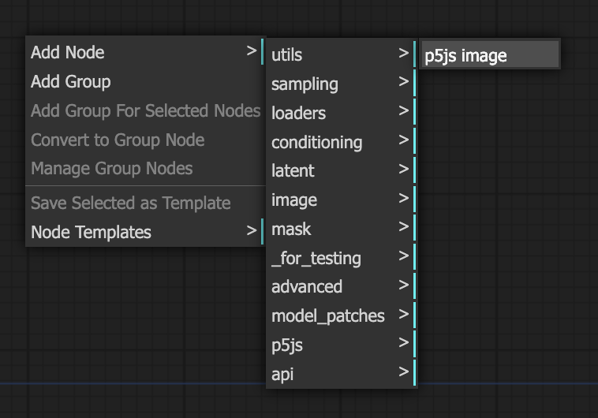

# p5.js + ComfyUI on Mac M1

*Brief instructions to use Stable Diffusion AI in ComfyUI, to interpret images generated by p5.js sketches, on a Mac. With this setup, you can use traditional generative art to scaffold more naturalistically textured images.* — Golan Levin, May 2024


This page adapts instructions and other media from: 

* [comfyui-p5js-node](https://github.com/tracerstar/comfyui-p5js-node), a custom node for connecting p5.js into ComfyUI, created by Benjamin Fox (@tracerstar)
* [ComfyUI on Apple Silicon from Scratch — 2024](https://medium.com/@tchpnk/comfyui-on-apple-silicon-from-scratch-2024-58def01a3319) by Jason Griffin

You'll need: 

* Recent versions of Git and Python installed. I'm using Python 3.12.3 on a 16GB Mac M1, running Sonoma 14.5.
* At least 4GB of disk space (and preferably more like 20GB). 
* Basic familiarity with p5.js and commmand line.

#### Contents

1. Getting ComfyUI Working
2. Integrating p5 into ComfyUI

---

## 1. Getting ComfyUI Working

ComfyUI is a node-based, web-based GUI for Stable-Diffusion-based image synthesis. 

#### Install Git

* Open your Terminal.app. 
* Install Git if necessary: `git -v`. If you don’t have `git` installed, you will also be asked to install the command line developer tools.

#### Create a Python virtual environment

I always advise doing your Python work in a dedicated virtual environment. This way, when you install a bunch of weird stuff, you don't hose your entire computer. 

* Cd to your desired directory, e.g.: `cd /Users/myUserName/Desktop/comfy-p5`
* Create the virtual environment: `python3.12 -m venv myComfyEnv`
* Activate the virtual environment: `source myComfyEnv/bin/activate`

#### Install PyTorch

* Install PyTorch nightly in your virtual environment: `pip3 install --pre torch torchvision torchaudio --extra-index-url https://download.pytorch.org/whl/nightly/cpu`

#### Install ComfyUI

The following instructions are adapted from here: [ComfyUI on Apple Silicon from Scratch — 2024](https://medium.com/@tchpnk/comfyui-on-apple-silicon-from-scratch-2024-58def01a3319) by Jason Griffin. 

* With your virtual environment activated, clone the ComfyUI repo: `git clone https://github.com/comfyanonymous/ComfyUI.git`
* Change directory to ComfyUI: `cd ComfyUI`
* Install Python dependencies: `pip3 install -r requirements.txt`
* Test the ComfyUI install: `python3 main.py`
* View the ComfyUI GUI in browser: [http://127.0.0.1:8188](http://127.0.0.1:8188)
* Stop the server: `control-C` in Terminal.

#### Install ComfyUI-Manager

> *ComfyUI-Manager is an extension designed to enhance the usability of ComfyUI. It offers management functions to install, remove, disable, and enable various custom nodes of ComfyUI.*

* Change to the `ComfyUI/custom_nodes` folder: `cd custom_nodes`
* Clone ComfyUI-Manager repo: `git clone https://github.com/ltdrdata/ComfyUI-Manager.git`
* Change back to the ComfyUI folder: `cd ..`
* Run ComfyUI: `python3 main.py`
* View [http://127.0.0.1:8188](http://127.0.0.1:8188); you should now see *Manager* and *Share* buttons in the console.

#### Install a Model

We will obtain trained [image-generation models from civitai.com](https://civitai.com/models). *Note*: these models are often advertised with insipid and salacious thumbnail pics, but are generally capable of generating a much wider range of images than the thumbnails would suggest. Sigh.

* The default ComfyUI workflow is setup for use with a Stable Diffusion 1.5 checkpoint.
* We'll get things started with the [DreamShaper 8 checkpoint](https://civitai.com/models/4384/dreamshaper) model page.
* Click the *Download* button. If a choice is presented, download the “Model SafeTensor”, about 2GB.


* Once the checkpoint file (*dreamshaper_8.safetensors*) has been downloaded, move it to `ComfyUI/models/checkpoints`. You can do this in Finder.
* If ComfyUI is running then click the *Refresh* button on the console to make the model available in the UI. Alternatively, starting or restarting ComfyUI will also make the model available in the UI.
* The *Load Checkpoint* node (at the far left of the default network) should automatically update, as there is only one model. If it doesn’t, then click its `ckpt_name` field and select *dreamshaper_8.safetensors*.

#### Generate an Image

* Add a prompt to the first *CLIP Text Encode* box. The prompt shown here is "beautiful scenery nature glass bottle landscape, purple galaxy bottle"
* Click *Queue Prompt* button in the console.
* To see the final image in the UI, you'll need to resize the *Save Image* node by dragging its bottom right corner.
* For more information, check out the [ComfyUI Academy tutorials on openart.ai](https://openart.ai/workflows/academy)



#### Finding other Models

Many other models are available. You need to obtain models in the correct format for things to work. Search for "SD 1.5" "Checkpoint" "Trained" "Safe Tensor" models [as in this search](https://civitai.com/search/models?baseModel=SD%201.5&modelType=Checkpoint&checkpointType=Trained&sortBy=models_v9). The following models are all working for me in this setup (these models are each 2-4GB in size): 

* [DreamShaper](https://civitai.com/models/4384/dreamshaper)
* [Realistic Stock Photo](https://civitai.com/models/139565/realistic-stock-photo) 
* [dvArch - Multi-Prompt Architecture Tuned Model](https://civitai.com/models/8552/dvarch-multi-prompt-architecture-tuned-model)
* [Product Design (minimalism-eddiemauro)](https://civitai.com/models/23893/product-design-minimalism-eddiemauro)
* [Fruit Fusion](https://civitai.com/models/18742/fruit-fusion)
* [Impressionism (Oil painting)](https://civitai.com/models/28068/impressionism-oil-painting)
* [Slate_pencil_mix](https://civitai.com/models/389528/slatepencilmix)

---

## 2. Integrating p5 into ComfyUI

We are using [comfyui-p5js-node](https://github.com/tracerstar/comfyui-p5js-node), a custom node for ComfyUI by Benjamin Fox.


* In Terminal, change directory to: `cd ComfyUI/custom_nodes`
* Install comfyui-p5js-node: `git clone https://github.com/tracerstar/comfyui-p5js-node.git`
* Refresh Comfy-UI. 
* On the desktop of ComfyUI, right-click to add a new p5js node, as shown here: 



* In the text field of the p5js node, paste the code of your sketch. Per @tracerstar,  note that "this is not a full-blown p5js editor; there's no debugging or error checking here. This node expects a working sketch to be pasted in the input to render to a canvas." The p5 code I'm using is the following:

```
// Used with the Stable Diffusion prompt: 
// > large horned beetle insects still life on a table

function setup() {
  createCanvas(512, 512);
}

function draw() {
  background('AntiqueWhite'); 
  noStroke(); 
  
  fill('LightSlateGray'); 
  rect(0,0,width,220); 
  
  fill(70, 40, 10); 
  ellipse(220,430, 200,80); 
  fill(90, 60, 15); 
  ellipse(370,340, 120,60); 
}
```

* When writing your p5js sketch, make sure you use the basic method of creating a canvas in your setup method. As of May 2024, the JS will only grab the p5js main default canvas object.
* Test that the p5js node is working correctly by pressing "Run Sketch".
* We now need to connect the p5js node into the default network. I made the following changes to the default ComfyUI network:
  * Create a *VAE Encode* node. 
  * Connect `image` of the *p5js* node to `pixels` of the *VAE Encode* node. 
  * Connect `VAE` of the *Load Checkpoint* node to `vae` of the *VAE Encode* node. 
  * Connect `latent` of the *VAE Encode* node, to `latent_image` of the *KSampler* node.
  * Discard the previous *Empty Latent Image*.
  * Feel free to add *Preview Image* nodes at intermediate points along the chain.
  * You can download my [Comfy workflow document](p5js_in_comfyui_workflow.json) here if you want to try. 


* Pressing "Queue Prompt" will trigger the node to pass control to the JS to query for the canvas obect in the iframe and then return it back for processing to an image. Fun!
* Benjamin Fox advises that "If you lower the *denoise* value in the sampler a little bit (maybe 0.7) it'll more closely match the sketch." I got good results with a *denoise* value of 0.85. 
* Fox also advises that, in case you need to update the version of `comfyui-p5js-node`, it's unlikely that it is listed (yet) in the Comfy Manager node, so "the best thing to do is cd to the `ComfyUI/custom_nodes` folder, delete the p5js node folder, and then do the command-line install of that node again", as follows:

```
: Commands to reinstall comfyui-p5js-node:
cd custom_nodes
rm -rf comfyui-p5js-node
git clone https://github.com/tracerstar/comfyui-p5js-node.git
```


---
## Quickstart Reminder

Once you have everything set up, here's the quick summary to launch:

```
: Commands to re-launch ComfyUI
cd ComfyUI
python3 main.py
open http://127.0.0.1:8188
```

---

## Gallery

Below, **at left:** a simple generative design made in p5.js, consisting of several thousand ellipses with randomized positions, sizes, and colors. **At right:** the lefthand p5.js image, interpreted by Stable Diffusion using the prompt "bowl of oatmeal". 


Below, **at left:** a collection of randomly oriented cubes, generated in p5.js using a limited color palette. **At right:** the lefthand p5.js image, interpreted by Stable Diffusion with the prompt "crystals, geodes". *Image by Benjamin Fox.* 


