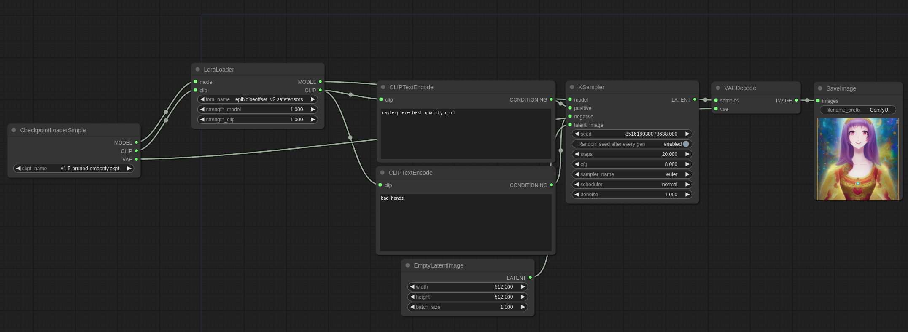
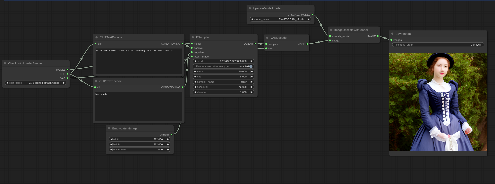

# More about ComfyUI

[The repo linked here](https://github.com/comfyanonymous/ComfyUI_examples) contains examples of what is achievable with ComfyUI.

---

### Using LoRAs in ComfyUI

(Information from [here](https://comfyanonymous.github.io/ComfyUI_examples/lora/).) LoRAs are patches applied on top of the main MODEL and the CLIP model. To use them put them in the `models/loras` directory and use the LoraLoader node like this:

---

### Models for Upscaling

(Information from [here](https://comfyanonymous.github.io/ComfyUI_examples/upscale_models/).)
Here is an example of how to use upscale models like ESRGAN. Put them in the `models/upscale_models` folder then use the UpscaleModelLoader node to load them and the ImageUpscaleWithModel node to use them. Some upscale models can be found at [openmodeldb.info](https://openmodeldb.info/).

> For this form of upscaling, a Machine Learning Model is trained on image pairs of a low-resolution and a high-resolution version of the same image. The model learns the most statistically likely way to upscale the image to produce results like that of the data it was trained on. Most of the models on OpenModelDB have been trained with specialized datasets, and therefore work best on specific kinds of content.

---

### Using Pose

Using instructions [here](https://comfyanonymous.github.io/ComfyUI_examples/controlnet/)

From [here](https://huggingface.co/webui/ControlNet-modules-safetensors/tree/main), I downloaded:

* control_openpose-fp16.safetensors
* control_scribble-fp16.safetensors

ControlNet model files go in the `ComfyUI/models/controlnet` directory.

Colors: 

* https://github.com/lllyasviel/ControlNet/discussions/266#discussioncomment-5299680
* https://github.com/CMU-Perceptual-Computing-Lab/openpose/blob/master/include/openpose/pose/poseParametersRender.hpp
* https://observablehq.com/@hellonearthis/bwalker-to-open-pose
* https://github.com/fkunn1326/openpose-editor/blob/master/README.en.md
* https://openposeai.com/
